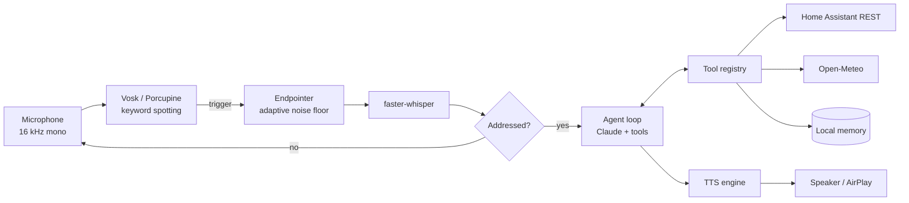

# Friday

Self-hosted voice assistant for a smart home. Wake word detection and speech recognition run locally; reasoning is delegated to Claude via tool calling; device control goes through Home Assistant.


## Features

- Two-stage wake word (Vosk keyword spotting + Whisper verification), Porcupine as an alternative backend
- Local STT with faster-whisper; audio never leaves the machine
- LLM agent loop with tool calling, bounded rounds and history trimming that preserves `tool_use` / `tool_result` pairs
- Tool plugins: a typed Python function with `@tool` becomes an LLM tool, JSON Schema is derived from type hints
- Home Assistant integration over REST (Matter devices via HA multi-admin)
- Pluggable TTS: ElevenLabs, Silero (local), macOS `say`, with automatic fallback
- Home location resolved once by IP and cached; timezone derived from it
- Persistent user facts injected into the system prompt
- Reminders and timers with recurrence, spoken on time, mirrored to macOS notifications and optionally Apple Reminders
- Latency masking: per-tool filler phrases played from a local audio cache while tools and the model run
- Streaming TTS playback and prompt caching for the static part of the system prompt

## Architecture



### Request lifecycle

1. `MicStream` delivers 32 ms frames into a queue; a 2 s ring buffer is kept as pre-roll.
2. The keyword spotter emits a trigger on the exact token `пятница`.
3. `Endpointer` records until 0.9 s of silence, using a threshold derived from the running noise floor.
4. Whisper transcribes pre-roll + phrase. The command is accepted only if the wake word appears within the first three tokens (`split_wake_command`). This rejects false triggers such as "в пятницу пойдём в кино".
5. The agent calls Claude with the tool schemas; tool calls are executed and fed back until a final text response or `MAX_TOOL_ROUNDS`. On the first tool call a filler phrase ("Смотрю прогноз.") is played in the background from a pre-synthesized cache, so the user hears a response within a second while tools and the second model round run.
6. The response is synthesized via the streaming endpoint and playback starts with the first audio chunk. The listener waits for the output latency (about 2 s for AirPlay/HomePod, auto-detected), flushes the microphone queue to discard self-echo, then a follow-up window (`FOLLOWUP_SECONDS`) accepts the next utterance without the wake word. Utterances that match the last answer (`is_self_echo`) are dropped.

### Components

| Module | Responsibility |
|---|---|
| `friday/agent.py` | Conversation state, tool-calling loop, system prompt assembly |
| `friday/prompts.py` | Persona and behavioral rules |
| `friday/tools/registry.py` | `@tool` decorator, schema generation, safe execution |
| `friday/tools/*.py` | Tool implementations, auto-discovered at startup |
| `friday/integrations/homeassistant.py` | Home Assistant REST client |
| `friday/location.py` | IP geolocation with on-disk cache and env override |
| `friday/voice/audio.py` | Shared microphone stream |
| `friday/voice/wakeword.py` | Keyword spotting backends |
| `friday/voice/listener.py` | Wake wait, endpointing, wake word verification |
| `friday/voice/stt.py` | Transcription and hallucination filtering |
| `friday/voice/tts.py` | TTS backends and text normalization |
| `friday/voice_setup.py` | Provisioning the ElevenLabs voice |
| `friday/voice/output.py` | Single speech output: lock, filler phrases, phrase cache prefetch |
| `friday/reminders.py` | Reminder storage (SQLite), time parsing, recurrence |
| `friday/scheduler.py` | Background thread that announces due reminders |
| `friday/integrations/apple_reminders.py` | Optional mirror to Apple Reminders via AppleScript |

## Requirements

- macOS on Apple Silicon or Intel (Linux works for everything except `say` and `afplay`)
- Python 3.11+
- Anthropic API key
- Optional: Home Assistant instance, ElevenLabs API key, Picovoice access key

## Installation

```bash
git clone https://github.com/jeezdredd/friday.git
cd friday
python3.11 -m venv .venv
source .venv/bin/activate
python -m pip install -U pip
python -m pip install -e ".[voice,dev]"
cp .env.example .env
```

Optional extras:

| Extra | Installs | Needed for |
|---|---|---|
| `voice` | numpy, sounddevice, faster-whisper, vosk | Any voice mode |
| `silero` | torch, num2words | `TTS_ENGINE=silero` |
| `porcupine` | pvporcupine | `WAKE_ENGINE=porcupine` |
| `dev` | pytest, ruff, num2words | Development |

The Vosk model (~45 MB) and the Whisper model are downloaded on first use.

## Usage

```bash
python -m friday            # text REPL
python -m friday --speak    # text REPL, responses are spoken
python -m friday --voice    # wake word mode
python -m friday --ptt      # push-to-talk mode (Enter to start/stop)
python -m friday --tools    # list registered tools
python -m friday -v ...     # INFO logging, including tool calls and false triggers
```

REPL commands: `/reset` clears the conversation, `exit` quits.

## Configuration

All settings are read from environment variables or `.env`. Full list with defaults: [`.env.example`](.env.example).

| Variable | Default | Description |
|---|---|---|
| `ANTHROPIC_API_KEY` | | Required |
| `FRIDAY_MODEL` | `claude-sonnet-5-5` | Model ID |
| `FRIDAY_MAX_HISTORY` | `30` | Messages kept in context |
| `FRIDAY_DATA_DIR` | `~/.friday` | Local state (memory, caches, models) |
| `FRIDAY_TIMEZONE` | from location | IANA timezone override |
| `HOME_LAT`, `HOME_LON`, `HOME_CITY` | from IP | Location override |
| `HA_URL`, `HA_TOKEN` | `http://localhost:8123` | Home Assistant endpoint and long-lived token |
| `FRIDAY_DEFAULT_LIGHT` | | Entity used when none is specified |
| `WHISPER_MODEL` | `small` | `tiny` / `base` / `small` / `medium` / `large-v3` |
| `WAKE_ENGINE` | `vosk` | `vosk` or `porcupine` |
| `SILENCE_SECONDS` | `0.9` | Pause that ends a phrase |
| `FOLLOWUP_SECONDS` | `4` | Follow-up window, `0` disables |
| `REMINDER_CHECK_SECONDS` | `10` | Reminder scheduler polling interval |
| `APPLE_REMINDERS_LIST` | | Mirror one-off reminders to this Apple Reminders list; empty disables |
| `OUTPUT_LATENCY` | auto | Output delay in seconds; auto-detects AirPlay (2.0) vs local (0.3) |
| `TTS_ENGINE` | `say` | `elevenlabs`, `silero` or `say` |
| `ELEVENLABS_API_KEY`, `ELEVENLABS_VOICE_ID` | | ElevenLabs credentials and voice |
| `ELEVENLABS_MODEL` | `eleven_v4_turbo` | Falls back to `eleven_multilingual_v2` if unavailable on the plan |
| `ELEVENLABS_STABILITY` / `_SIMILARITY` / `_STYLE` / `_SPEED` | `0.5` / `0.75` / `0` / `1.0` | Voice settings |
| `ELEVENLABS_STRESS` | `acute` | How dictionary stress marks are passed: `acute` or `none` |

## Integrations

### Home Assistant and Matter

HomeKit has no public API outside native Apple apps, so devices are accessed through Home Assistant. Matter multi-admin lets a device stay paired with Apple Home while also being controlled by HA.

1. Run Home Assistant. On macOS use HA OS in a VM (UTM) or a separate host; Docker Desktop on macOS does not provide the host networking Matter requires. `docker-compose.yml` targets a Linux host.
2. Add the Matter integration in HA.
3. In Apple Home: device settings, *Turn On Pairing Mode*, copy the code.
4. In HA: *Add device*, *Matter*, paste the code.
5. Create a long-lived access token in the HA user profile and set `HA_TOKEN`.

### Voice provisioning

```bash
python -m friday.voice_setup                    # design a voice; falls back to --pick on the free plan
python -m friday.voice_setup --pick [--all]     # choose from voices available to the account
python -m friday.voice_setup --voice-id <id>    # set a known voice directly
```

On paid plans the script generates candidates from a text description via Voice Design, plays them and saves the selected one to the account. Voice creation through the API is not available on the free plan; in that case the script lists the account's voices (female first), plays samples (`p N`), synthesizes a Russian test phrase (`t N`, consumes quota) and stores the choice. Either way, `ELEVENLABS_VOICE_ID` and `TTS_ENGINE=elevenlabs` are written to `.env`. Cloning a real person's voice without consent is not supported.

### Speech text and pronunciation

Responses pass through `friday/voice/speech_text.py` before synthesis:

1. Pronunciation dictionary: English names to Cyrillic, abbreviations expanded, stress fixes. Stress is written with `+` before the stressed vowel (`зам+ок`) and rendered per engine: combining acute accent for ElevenLabs, `+` for Silero, stripped for `say`.
2. Punctuation normalization: dashes and parentheses become comma pauses, quotes and markdown are removed, every phrase gets terminal punctuation.

The system prompt additionally requires `ё`, numbers as words in the correct case, and no abbreviations, because the model output is the main lever for prosody.

User overrides in `~/.friday/pronunciations.json` (merged over the defaults):

```json
{"замок": "зам+ок", "Алматы": "Алмат+ы"}
```

Check the result without calling the LLM:

```bash
python -m friday --say "Включила HomePod, т.е. музыка играет"
```

Model choice matters more than settings. The default is `eleven_v4_turbo`, which ElevenLabs positions for real-time assistants. If it is not available on the plan, the client falls back to `eleven_multilingual_v2` at runtime and retries without `language_code` if a model rejects it. `eleven_flash_v2_5` has the lowest latency but flatter Russian intonation.

### Reminders and timers

Ask in natural language: "Пятница, напомни через двадцать минут выключить духовку", "поставь таймер на десять минут", "напоминай по будням в девять утра выпить таблетки", "что у меня запланировано", "отмени напоминание про духовку".

- The model passes either `delay_minutes` (relative time) or `when` as local ISO time; date arithmetic is done in code, not by the model.
- Stored in SQLite (`~/.friday/friday.db`) in UTC. Recurrence (`daily`, `weekdays`, `weekly`) is computed in local time, so 08:00 stays 08:00 across DST changes.
- A background scheduler announces due reminders through the shared speech lock (never on top of an answer) and posts a macOS notification.
- Reminders missed while the process was not running are announced at startup as missed; recurring ones skip past occurrences instead of firing repeatedly.
- `APPLE_REMINDERS_LIST=Пятница` additionally creates one-off reminders in Apple Reminders, so they reach the iPhone and Watch. macOS asks for automation permission on first use.

Reminders fire only while Friday is running. Run it as a background service for always-on behavior (see Roadmap).

### Latency

Run with `-v` to see per-stage timings: speech recognition, each LLM round with cached token count, each tool call, time to first TTS audio and total time to the end of speech. Typical levers, by impact:

1. `FRIDAY_MODEL`: a smaller model shortens both LLM rounds.
2. Output device: AirPlay adds about 2 s of buffering compared to the Mac speakers.
3. `WHISPER_MODEL=base` speeds up recognition at some accuracy cost.
4. Filler phrases do not reduce latency but remove the silence; per-tool phrases are set with `@tool(filler="...")`, `filler=""` disables them for fast tools.

### Porcupine

Train the keyword in [Picovoice Console](https://console.picovoice.ai/) (language: Russian), then set `WAKE_ENGINE=porcupine`, `PORCUPINE_ACCESS_KEY`, `PORCUPINE_KEYWORD_PATH` and `PORCUPINE_MODEL_PATH` (`porcupine_params_ru.pv`).

## Extending

A tool is a typed function with a docstring placed in any module under `friday/tools/`. Modules are imported automatically; names starting with `_` are skipped.

```python
from typing import Annotated, Literal

from friday.tools import tool


@tool
def play_music(
    query: Annotated[str, "Artist, track or playlist"],
    source: Literal["apple_music", "spotify"] = "apple_music",
) -> str:
    """Start music playback."""
    ...
```

Contract:

- The docstring is the tool description sent to the model and is mandatory.
- Supported annotations: `str`, `int`, `float`, `bool`, `Literal`, `list[T]`, `dict`, `T | None`, `Annotated[T, "description"]`.
- Parameters without defaults are required.
- Return `str` or any JSON-serializable value.
- Exceptions are caught and returned to the model as `is_error` results; they do not crash the loop.
- `@tool(filler="...")` sets the phrase spoken while the tool runs; `filler=""` keeps silent for fast tools, omitted uses a generic phrase.
- Tools with side effects that cannot be undone must be confirmed by the user; the system prompt enforces this, keep the tool description explicit about it.

New TTS backends implement `speak(text: str) -> None` and are registered in `create_speaker()`. New wake word backends implement `frame_samples`, `process(frame) -> bool` and `reset()`.

## Data and privacy

| Data | Destination |
|---|---|
| Raw audio | Never leaves the machine |
| Transcribed requests, conversation history, tool results | Anthropic API |
| Response text | ElevenLabs API (only with `TTS_ENGINE=elevenlabs`) |
| Public IP | ipinfo.io or ipapi.co, once, then cached |
| Home coordinates | Open-Meteo, on weather requests |
| Device states and commands | Local Home Assistant |

Local state in `FRIDAY_DATA_DIR`: `memory.json`, `location.json`, `models/`, `voice_previews/`. Secrets live only in `.env`, which is git-ignored.

## Development

```bash
pytest
ruff check .
ruff format .
```

Tests do not require network, audio hardware or API keys: network access is stubbed in `tests/conftest.py`, the agent is tested against a fake client, and audio logic (`Endpointer`, wake word parsing, text normalization) is pure.

## Troubleshooting

| Symptom | Fix |
|---|---|
| `pyenv: pip: command not found` | The venv is not active: `source .venv/bin/activate` |
| `No module named 'encodings'` when creating the venv | Remove the broken `.venv` and recreate it |
| No audio input | Grant microphone access to the terminal in System Settings, Privacy & Security |
| Frequent false triggers | Run with `-v` to inspect them; consider `WAKE_ENGINE=porcupine` |
| Phrases cut off | Increase `SILENCE_SECONDS` |
| Wrong city | Set `HOME_LAT` / `HOME_LON` or delete `~/.friday/location.json` |

## Roadmap

- [x] Streaming TTS playback
- [ ] Sentence-level streaming from LLM to TTS
- [ ] Scheduled proactive briefings
- [ ] Run as a launchd service so reminders fire without an open terminal
- [ ] Apple Calendar integration
- [ ] Confirmation flow for irreversible actions enforced in code, not only in the prompt
- [ ] Web dashboard: status, history, memory management
- [ ] CI pipeline

## License

[MIT](LICENSE)
